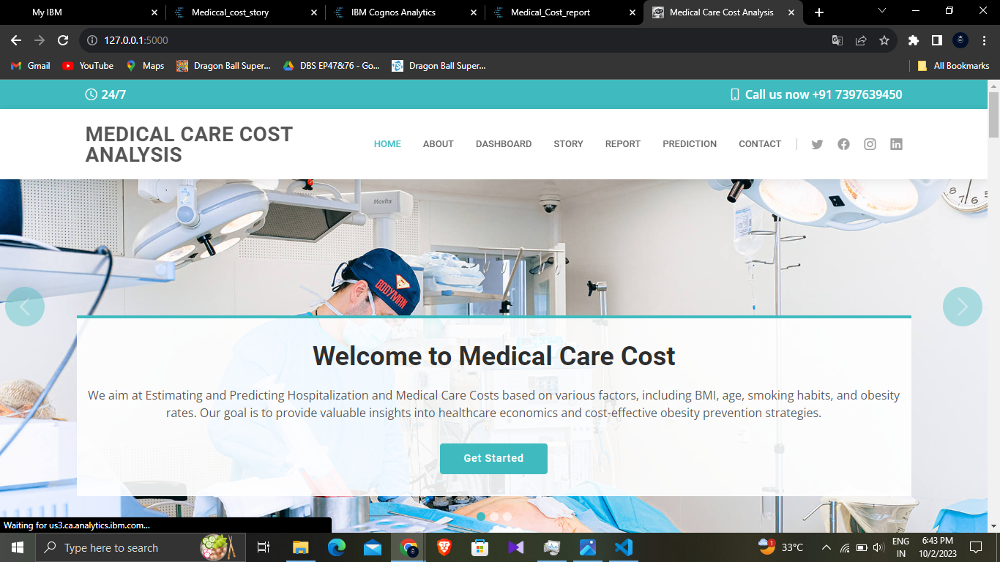
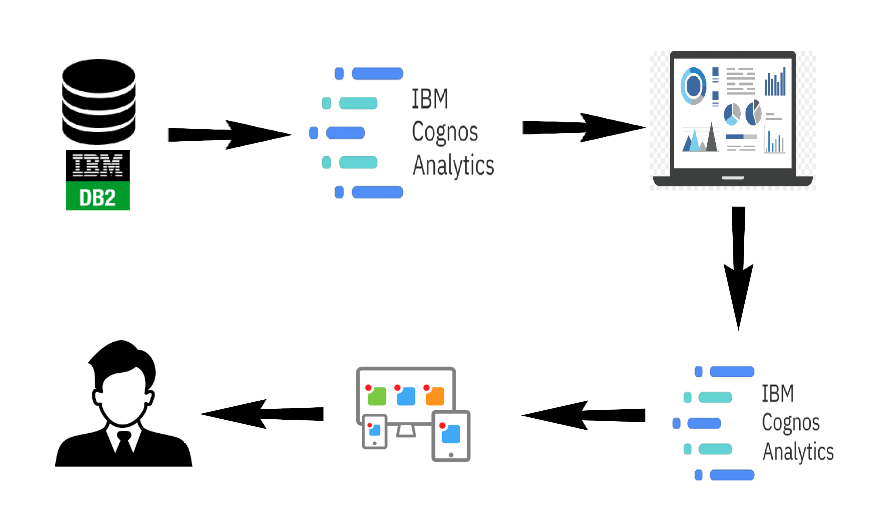
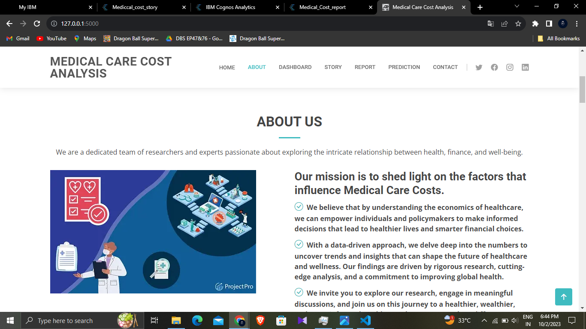
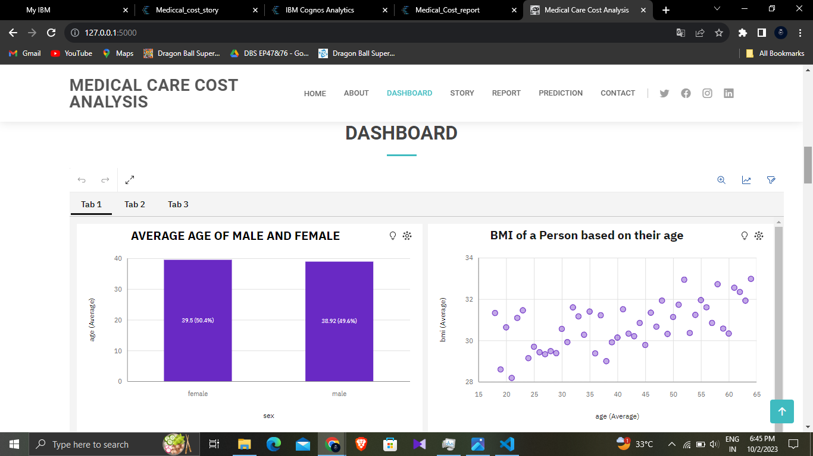
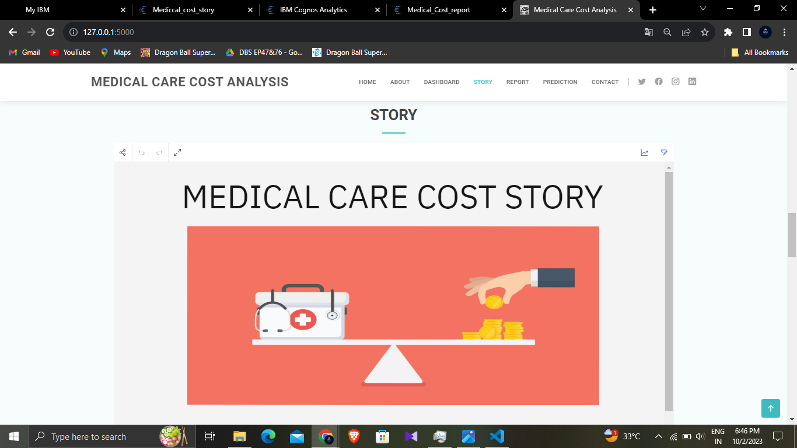
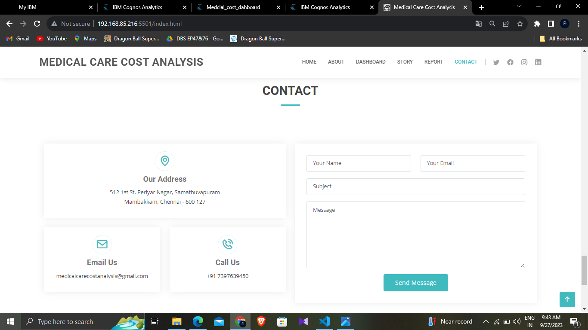
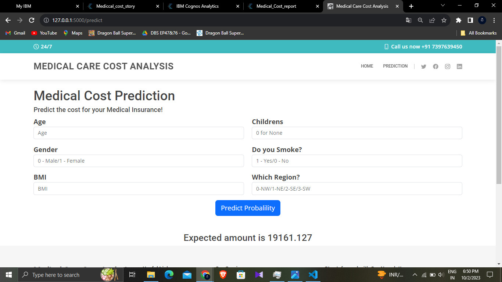

# Medical Care Cost

Demo Video: https://youtu.be/HEaFU68WAPM

# Problem Statement

Medical costs are one of the most common recurring expenses in a person's life. Based on different research studies, BMI, ageing, smoking, and other factors are all related to greater personal medical care costs. The estimates of the expenditures of health care related to obesity are needed to help create cost-effective obesity prevention strategies. Obesity prevention at a young age is a top concern in global health, clinical practice, and public health.s.

# Home

# Technical Architecture

## Built with
* Python
* Google Colab
* HTML
* CSS
* JavaScript

## Libraries

* sklearn
* sklearn.preprocessing
* sklearn.metrics
* sklearn.pipeline
* PIL
* pathlib
* scipy
* os
* numpy
* matplotlib.pyplot
* pandas
* Flask
* Flask-Cors
* seaborn
  
# About

# Dashboard

# Story

# Report

# Contact

## Demo

## How this project does?

1. First of all download the dataset. 
Link for dataset : https://github.com/BHARATHVAJSARAVANAN/Medical-Care-Cost-Analysis-/blob/cd2eff644ea82c4810495a17f04919a5b339e34b/insurance%20dataset.csv

2. Create an IBM account and get accesss to IBM Cognos Analytics and IBM Cloud.

3. Link IBM Cognos analytics and IBM Cloud

4. Upload the Medical Dataset
   
5. Create Dasboard, Story and Result for the Medical care cost 

6. Create a Website using HTML, CSS, Javascipt and Integrated with Dashboard, Story and Report.

7. The data was cleaned (it was super unclean :( ) and analysed.

8. Then a SVR model was built on top of it which had 0.88 R2_score.

   Link for notebook : https://github.com/BHARATHVAJSARAVANAN/Medical-Care-Cost-Analysis-/blob/cd2eff644ea82c4810495a17f04919a5b339e34b/medical_care_cost.py
   
10. This project was given the form of an website built on Flask where we used the Linear Regression model to perform predictions.

## How to run on your local host?

Prerequisite: Download all files from Github Link : https://github.com/BHARATHVAJSARAVANAN/Medical-Care-Cost-Analysis-

Download PyCharm

1. Create new environment using command --> conda create -n env_name python==3.10.2
   
2. Activate environment using command --> conda activate env_name
   
3. Install requirements by typing (cd ProjectFolder) --> pip install -r requirements.txt
   
4. Now run app.py by writing command --> python app.py

OR

Download VScode

1. Download Project code from github 
   
2. Open Medical Care Cost Analysis Folder in VScode.
   
3. Open Terminal and Install requirements by typing (cd ProjectFolder) --> pip install -r requirements.txt
   
4. Now run app.py by writing command --> python app.py

Medical DATASET : https://github.com/BHARATHVAJSARAVANAN/Medical-Care-Cost-Analysis-/blob/cd2eff644ea82c4810495a17f04919a5b339e34b/insurance%20dataset.csv
